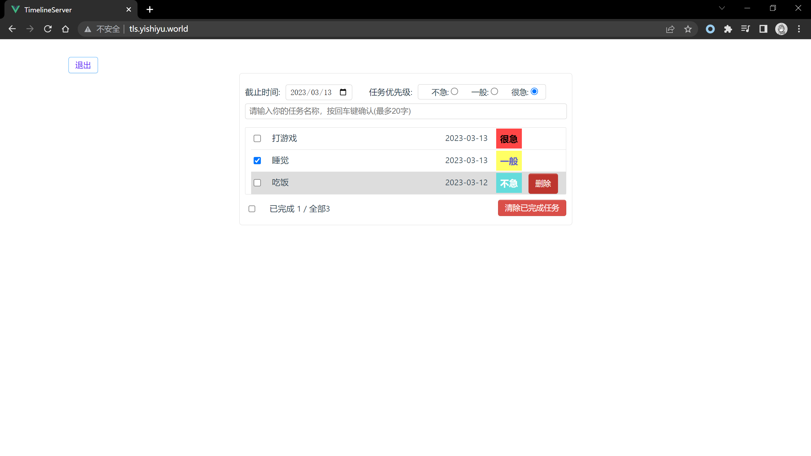
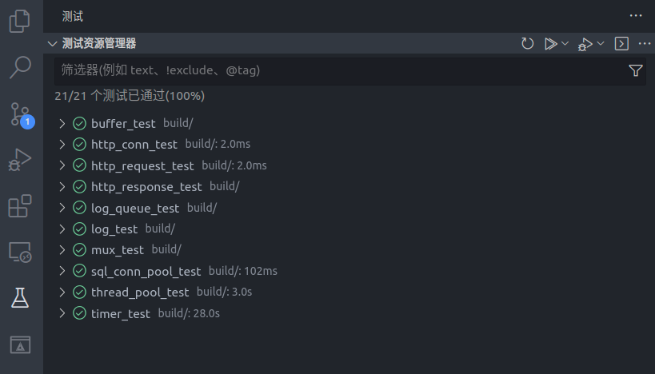
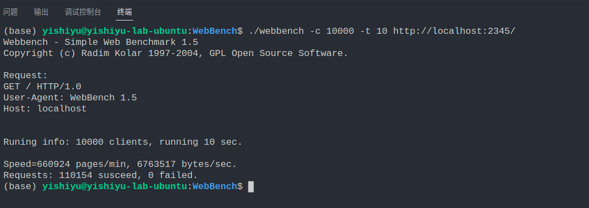

# TimelineServer

使用 C++实现的 Web 服务器,代码规范参考的是[Google 命名约定](https://zh-google-styleguide.readthedocs.io/en/latest/google-cpp-styleguide/naming/)

[相关笔记 | 遗世の私语](http://yishiyu.world/2023/01/28/TimelineServer-%E6%A6%82%E8%BF%B0/)  
[前端代码仓库 | Github](https://github.com/zjulzy/TimeLineFrontend)

## 功能

主体框架参照了[WebServer](https://github.com/markparticle/WebServer)项目,同时增加了以下功能:

- 基于注册的静态请求跳转(如"/"跳转到"/index.html")
- 基于回调函数的动态请求处理(登录/数据库增删改查)
- POST 请求解析(原项目做了"urlencoded"格式请求体的解析,改成了"json"格式的解析)
- 基于"MySQL Connector/C++"的数据库系统(原项目使用的是 C 的数据库函数)
- 利用"gtest"为每一个模块都写了模块测试
- 网络记事本的业务函数

## 效果展示








## 环境安装与测试

- 配置 mysql

  ```shell
  # 安装 mysql 数据库(服务器+客户端)
  # 并配置用户账号密码和代码中对应
  # 默认为 root explosion

  # 创建数据库
  CREATE DATABASE timelineserver;
  CREATE TABLE IF NOT EXISTS users(
      user_id BIGINT(20) UNSIGNED AUTO_INCREMENT,
      user_name VARCHAR(40) NOT NULL,
      user_passwd VARCHAR(40) NOT NULL,
      PRIMARY KEY (user_id)
  );
  CREATE TABLE IF NOT EXISTS tasks(
      task_id BIGINT(20) UNSIGNED AUTO_INCREMENT,
      user_id BIGINT(20) UNSIGNED NOT NULL,
      time DATE NOT NULL,
      task VARCHAR(300) NOT NULL,
      priority INT DEFAULT 0 NOT NULL,
      PRIMARY KEY (task_id)
  );
  ```

- 安装依赖库

  ```shell
  sudo apt update

  # 安装 mysql connector
  sudo apt install libmysqlcppconn-dev

  # 安装 json11
  sudo apt install libjson11-1-dev
  ```

- 编译

  ```shell
  git clone https://github.com/yishiyu/TimelineServer.git
  bash ./build.sh
  ```

- 启动

  ```shell
  # cd 到 build 目录
  ./TimelineServer
  ```
